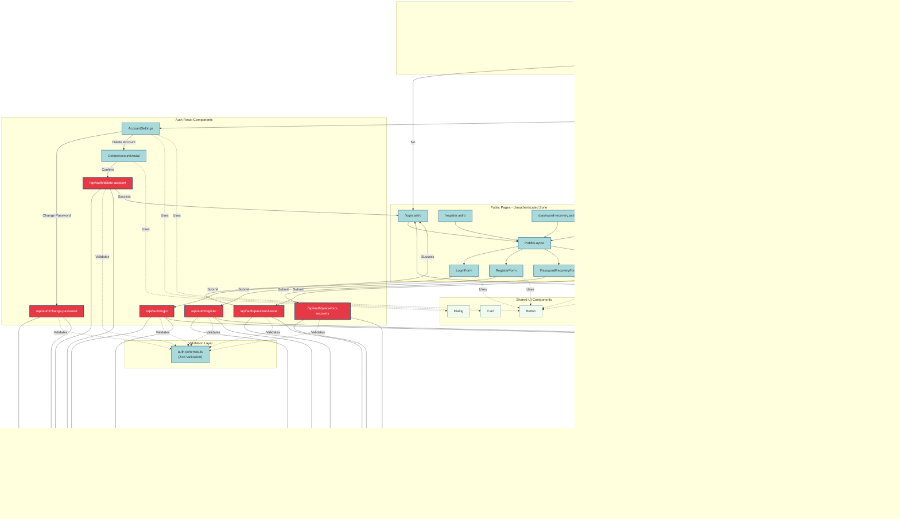

# Authentication UI Components Architecture Diagram

This diagram visualizes the architecture of Astro pages and React components for the authentication module in the 10xCards application.

## Architecture Overview

The authentication system is divided into:
- **Public Zone**: Unauthenticated pages (login, register, password recovery/reset)
- **Protected Zone**: Authenticated pages (account management, flashcards, study sessions)
- **Middleware Layer**: Session validation and routing logic
- **API Layer**: Authentication endpoints
- **Service Layer**: Business logic and Supabase integration

## Component Diagram

## Legend

- **Light Blue (New Components)**: Components and pages to be created for authentication
- **Light Green (Existing Components)**: Components that already exist and will be updated
- **Red (API Endpoints)**: Backend API endpoints for authentication operations
- **Yellow (Middleware)**: Request/response middleware layer

## Key Components

### Public Pages (New)
- **login.astro**: User login page
- **register.astro**: New user registration page
- **password-recovery.astro**: Password recovery initiation page
- **password-reset.astro**: Password reset completion page

### Protected Pages
- **my-account.astro** (New): Account management page
- **my-flashcards.astro** (Updated): Add authentication check and header
- **create-flashcards.astro** (Updated): Add authentication check and header
- **study-session.astro** (Updated): Add authentication check and header

### React Components (New)
- **LoginForm**: Email/password login form with validation
- **RegisterForm**: Registration form with password confirmation
- **PasswordRecoveryForm**: Email input for password recovery
- **PasswordResetForm**: New password input with token validation
- **AccountSettings**: Account management interface with change password and delete account
- **DeleteAccountModal**: Confirmation dialog for account deletion

### Layout Components (New)
- **PublicLayout**: Minimal layout for unauthenticated pages
- **ProtectedLayout**: Layout with header for authenticated pages
- **PersistentHeader** (Updated): Navigation header with logout button

### API Endpoints (New)
- POST `/api/auth/login`: Authenticate user
- POST `/api/auth/register`: Create new account
- POST `/api/auth/logout`: End user session
- POST `/api/auth/password-recovery`: Initiate password reset
- POST `/api/auth/password-reset`: Complete password reset
- POST `/api/auth/change-password`: Update user password
- DELETE `/api/auth/delete-account`: Delete user account

### Service Layer (New)
- **auth.service.ts**: Encapsulates Supabase Auth operations
- **auth.schemas.ts**: Zod validation schemas for authentication

## Data Flow

1. **Middleware** checks authentication status on every request
2. **Public pages** redirect authenticated users to `/my-flashcards`
3. **Protected pages** redirect unauthenticated users to `/login`
4. **Form components** validate input and submit to API endpoints
5. **API endpoints** validate with Zod schemas and call service layer
6. **Service layer** interacts with Supabase Auth
7. **Successful operations** redirect users to appropriate pages

## Dependencies

- All form components use shared UI components (Button, Card, Dialog)
- All API endpoints use validation schemas and service layer
- Middleware controls access to all pages based on authentication state
- Protected pages require PersistentHeader with logout functionality
