# Authentication User Journey Diagram - 10xCards

This diagram visualizes the complete user journey for the 10xCards application, showing how users navigate through public and protected zones based on their authentication state.

## User Journeys Covered

1. **New User Registration** - Creating an account and automatic login
2. **Existing User Login** - Authenticating with credentials
3. **Password Recovery** - Initiating password reset via email
4. **Password Reset** - Completing password change with token
5. **Protected Zone Access** - Navigating authenticated pages
6. **Account Management** - Changing password or deleting account
7. **Logout** - Ending session and returning to public zone

## Diagram

```mermaid
stateDiagram-v2
    [*] --> LandingPage
    
    state "Public Zone" as PublicZone {
        LandingPage: Landing Page
        LoginPage: Login Page
        RegisterPage: Register Page
        PasswordRecoveryPage: Password Recovery Page
        PasswordResetPage: Password Reset Page
        
        LandingPage --> LoginPage: User wants to login
        LandingPage --> RegisterPage: User wants to register
        
        state login_decision <<choice>>
        LoginPage --> login_decision: Submit credentials
        login_decision --> MyFlashcards: Valid credentials
        login_decision --> LoginPage: Invalid credentials
        
        LoginPage --> PasswordRecoveryPage: Forgot password link
        
        state register_decision <<choice>>
        RegisterPage --> register_decision: Submit registration
        register_decision --> MyFlashcards: Registration successful
        register_decision --> RegisterPage: Registration failed
        
        RegisterPage --> LoginPage: Already have account link
        
        state recovery_decision <<choice>>
        PasswordRecoveryPage --> recovery_decision: Submit email
        recovery_decision --> PasswordRecoveryPage: Email sent confirmation
        recovery_decision --> PasswordRecoveryPage: Error occurred
        
        PasswordRecoveryPage --> LoginPage: Back to login link
        
        state reset_decision <<choice>>
        PasswordResetPage --> reset_decision: Submit new password
        reset_decision --> LoginPage: Password reset successful
        reset_decision --> PasswordResetPage: Token invalid or expired
        
        note right of LoginPage
            User enters email and password
            Links to Register and Password Recovery
        end note
        
        note right of RegisterPage
            User enters email, password, confirm password
            Auto-login after successful registration
        end note
        
        note right of PasswordRecoveryPage
            User enters email
            Receives email with reset link
        end note
        
        note right of PasswordResetPage
            User clicks link from email
            Enters new password and confirm password
        end note
    }
    
    state "Protected Zone" as ProtectedZone {
        MyFlashcards: My Flashcards Page
        CreateFlashcards: Create Flashcards Page
        StudySession: Study Session Page
        MyAccount: My Account Page
        
        MyFlashcards --> CreateFlashcards: Navigate to create
        MyFlashcards --> StudySession: Start study session
        MyFlashcards --> MyAccount: Navigate to account
        
        CreateFlashcards --> MyFlashcards: Navigate to my flashcards
        CreateFlashcards --> StudySession: Navigate to study
        CreateFlashcards --> MyAccount: Navigate to account
        
        StudySession --> MyFlashcards: Session complete or navigate
        StudySession --> CreateFlashcards: Navigate to create
        StudySession --> MyAccount: Navigate to account
        
        state account_action <<choice>>
        MyAccount --> account_action: User action
        account_action --> MyAccount: Change password successful
        account_action --> LoginPage: Delete account successful
        account_action --> MyFlashcards: Navigate to my flashcards
        account_action --> CreateFlashcards: Navigate to create
        account_action --> StudySession: Navigate to study
        
        note right of MyFlashcards
            Default landing page after login
            View, search, edit, delete flashcards
            Paginated list (50 per page)
        end note
        
        note right of CreateFlashcards
            AI generation from text (1k-10k chars)
            Manual card creation
            Review and save candidates
        end note
        
        note right of StudySession
            Spaced repetition algorithm
            Show front, reveal back
            Grade: Forgot or Knew
        end note
        
        note right of MyAccount
            View email (read-only)
            Change password
            Delete account
        end note
    }
    
    state middleware_check <<choice>>
    PublicZone --> middleware_check: Request protected page
    middleware_check --> ProtectedZone: Valid session
    middleware_check --> LoginPage: No session or expired
    
    state logout_action <<choice>>
    ProtectedZone --> logout_action: Logout button clicked
    logout_action --> LoginPage: Session cleared
    
    state public_redirect <<choice>>
    PublicZone --> public_redirect: Authenticated user visits
    public_redirect --> MyFlashcards: Already logged in
    
    LoginPage --> [*]: User closes application
    MyFlashcards --> [*]: User closes application
```

## Key User Journeys

### 1. New User Registration Journey
1. User arrives at Landing Page
2. Clicks "Register" to navigate to Register Page
3. Enters email, password, and confirm password
4. Submits registration form
5. On success: Automatically logged in and redirected to My Flashcards
6. On failure: Error displayed, remains on Register Page

### 2. Existing User Login Journey
1. User arrives at Landing Page or Login Page
2. Enters email and password credentials
3. Submits login form
4. On success: Redirected to My Flashcards (default landing page)
5. On failure: Error displayed, remains on Login Page

### 3. Password Recovery Journey
1. User on Login Page clicks "Forgot password?" link
2. Navigates to Password Recovery Page
3. Enters email address
4. Submits form
5. Receives confirmation message (email sent)
6. Checks email and clicks reset link
7. Navigates to Password Reset Page with token
8. Enters new password and confirm password
9. On success: Redirected to Login Page with success message
10. On failure: Error displayed (token expired/invalid)

### 4. Protected Zone Navigation
1. User successfully logs in
2. Lands on My Flashcards (default page)
3. Can navigate freely between:
   - My Flashcards (view, search, edit, delete cards)
   - Create Flashcards (AI generation or manual creation)
   - Study Session (spaced repetition learning)
   - My Account (account settings)
4. Logout button available on all protected pages

### 5. Account Management Journey
1. User navigates to My Account page
2. Can perform actions:
   - View email (read-only)
   - Change password (requires current password)
   - Delete account (requires password confirmation)
3. Change password: Success toast, remains on page
4. Delete account: Logged out, redirected to Login Page

### 6. Logout Journey
1. User clicks Logout button (available on all protected pages)
2. Session cleared
3. Redirected to Login Page
4. Cannot access protected pages without re-authentication

## Middleware Protection

The middleware acts as a gatekeeper between public and protected zones:

- **Unauthenticated users** attempting to access protected pages are redirected to Login Page
- **Authenticated users** attempting to access public pages (Login, Register) are redirected to My Flashcards
- **Session validation** occurs on every request to protected routes
- **Expired sessions** trigger automatic redirect to Login Page

## Decision Points

1. **Login Decision**: Valid credentials → My Flashcards | Invalid → Error message
2. **Register Decision**: Success → Auto-login to My Flashcards | Failure → Error message
3. **Recovery Decision**: Email submitted → Confirmation message
4. **Reset Decision**: Valid token → Login Page | Invalid → Error message
5. **Middleware Check**: Valid session → Protected Zone | No session → Login Page
6. **Account Action**: Change password → Success toast | Delete account → Login Page
7. **Logout Action**: Always → Login Page with cleared session
8. **Public Redirect**: Authenticated user → My Flashcards

## User States

- **Unauthenticated**: Can only access public pages (Login, Register, Password Recovery, Password Reset)
- **Authenticated**: Can access all protected pages and navigate freely within the application
- **Session Expired**: Treated as unauthenticated, redirected to Login Page

## Empty States

- **My Flashcards (0 cards)**: Message with link to Create Flashcards
- **Study Session (0 cards)**: Message with link to Create Flashcards
- **Study Session (0 due cards)**: "You're all caught up!" message
